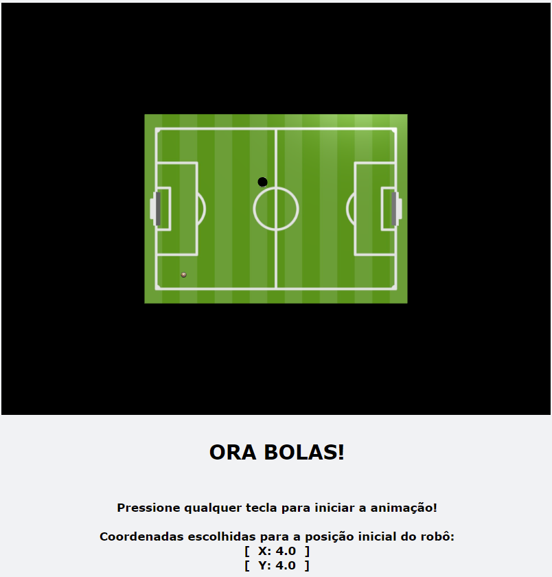
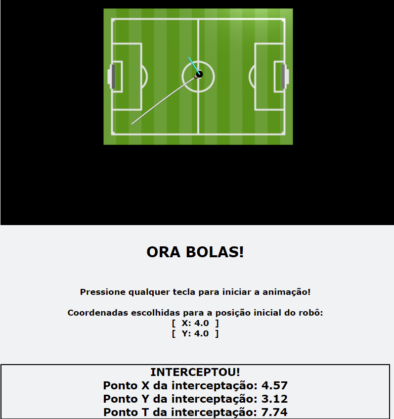

# Projeto Ora Bolas

## Funcionamento do Código:
* Digite as coordenadas iniciais do robô

   

* Se os valores passados estiverem dentro das especificações, será exibido um alerta informando que as coordenadas foram enviadas. Senão, outro alerta indicando o erro será exibido.

   

* Uma janela será aberta pedindo um instante qualquer da trajetória e exibirá os valores de acordo com o valor inserido.

   
   
   
   
* Fechando a janela, você será direcionado ao navegador, onde o vpython estará rodando. Basta seguir as orientações na própria página.

   

* Ao pressionar qualquer tecla, a animação começará.

   
   - Os pontos do momento de interceptação serão exibidos logo abaixo

* Após o término da animação, outra janela será aberta com as informações do robô e um botão para visualização dos gráficos

   

* Exemplo de gráfico

   
